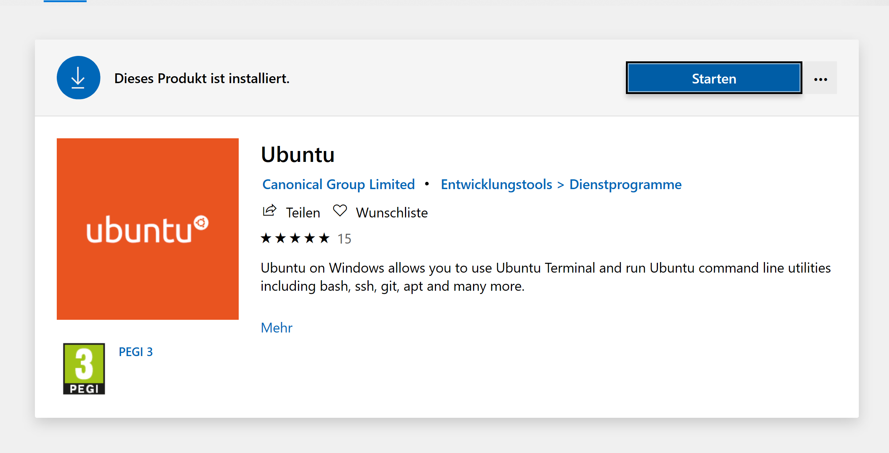

# Infrastructure.Windows.Automation.Ansible.WSL

Setting up Ansible on Windows with WSL (Windows Subsystem for Linux).

## Getting Started

### Prerequisites

| Program | Version | Link | Info |
|-------------|-------------|-----|--|
| Windows | 10 | https://www.microsoft.com/de-de/software-download/windows10 | N/A |

### Preparing

Clone or download the current repository to your preferred location.

### Installing

If you have not installed chocolatey on your windows host, please refer to https://chocolatey.org/install.

Open Command Prompt as administrator and switch to the location of the cloned or copied repository:

```
cd yourLocalRepositoryPath
```

Run command line script `installing.cmd` on your Windows host (as administrator):

```
installing.cmd
```

**Restart your computer!**

After restart, install Ubuntu WSL with Microsoft Store:



Search for Ubuntu on your windows and run Ubuntu App. Switch on the Ubuntu terminal to Windows standard drive "C":

```
cd ../../mnt/c
```

Switch to the location of the cloned or copied repository:

```
cd yourLocalRepositoryPath
```

Run shell script `installing.sh` on your ubuntu terminal (as sudo):

```
sudo ./installing.sh
```

## Running

Search for Ubuntu on your windows and run Ubuntu App. Switch on the Ubuntu terminal to Windows standard drive "C":

```
cd ../../mnt/c
```

Switch to the subfolder "ansible" in the location of the cloned or copied repository:

```
cd yourLocalRepositoryPath/ansible
```

Execute the following command on the Ubuntu WSL Terminal:

```
ansible-playbook playbook.yml -u YOUR-WINDOWS-USERNAME-OR-EMAIL --ask-pass
```

Enter your Windows password and after that ansible will run on your Windows host.

## Authors

- [Thierry Iseli](https://github.com/thierryiseli) - *Inital work*

## License

This project is licensed under the MIT License - see the [LICENSE](LICENSE) file for details.

## Built With

- [Ubuntu WSL](https://ubuntu.com/wsl)
- [Ansible](https://www.ansible.com/)
